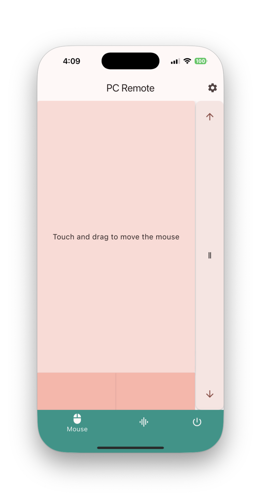
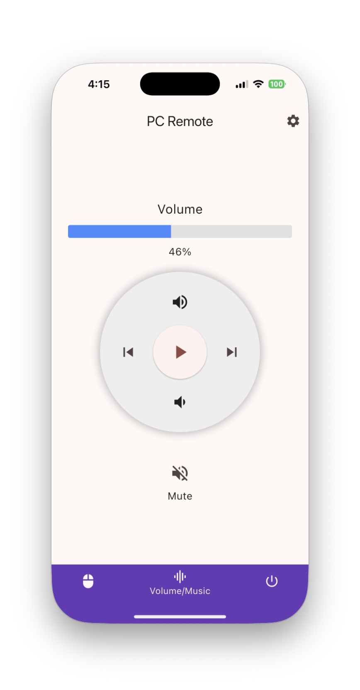
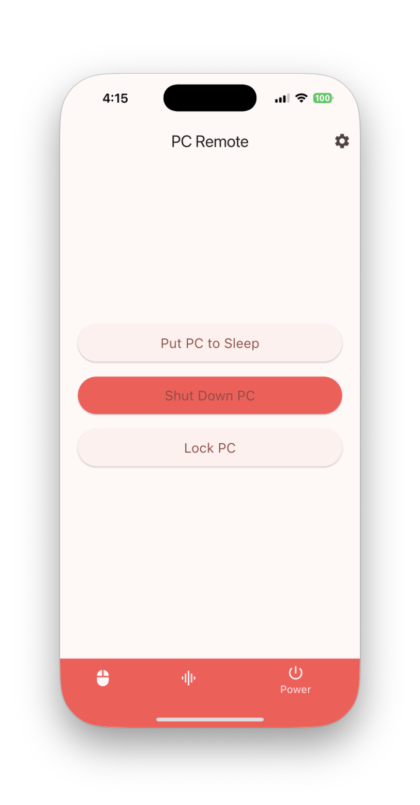
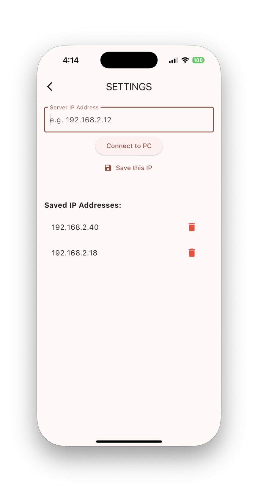

# PC Remote  
Control your PC’s mouse and volume using your mobile device.  

This application uses sockets with **TCP** and **UDP** for low-latency and instant feedback.  

---

## Features  
- 📱 Flutter mobile client  
- 💻 Go server for PC  
- 🎮 Control mouse and system volume remotely  
- ⚡ Uses TCP/UDP for responsive performance  
- 🖥️ Cross-platform support (Windows, macOS, Android, iOS)  

---

## Screenshots / GIFs

**_GIFs will be added soon!_**


<table align="center">
  <tr>
    <td align="center">
      <br/>
      <strong>Mouse Control</strong><br/>
      <em>Move cursor, left/right click, and scroll</em>
    </td>
    <td align="center">
      <br/>
      <strong>Volume Control</strong><br/>
      <em>Adjust system volume and mute/unmute</em>
    </td>
    <td align="center">
      <br/>
      <strong>Power Control</strong><br/>
      <em>Shutdown, lock, or sleep your PC</em>
    </td>
    <td align="center">
      <br/>
      <strong>Settings</strong><br/>
      <em>Configure the connected server and easily save or delete favorites</em>
    </td>
  </tr>
</table>

---

## Requirements  
- [Go 1.20+](https://go.dev/dl/)  
- [Flutter 3.10+](https://flutter.dev/docs/get-started/install)  

---

## Quick Start

### Client (Flutter)
```bash
cd client
flutter clean
flutter pub get
flutter run [--profile]
```

### Server (Go)
```bash
cd go-lang-server
go mod tidy
go run .
```

---

## Building

### Server

**macOS**  
```bash
go build -o PCRemoteServer main.go
# (Optional) Place that binary inside PCRemoteServer.app/Contents if packaging as a macOS app bundle
```

**Windows**  
```bash
go build -ldflags="-H=windowsgui" -o PCRemoteServer.exe main.go
```

---

## Downloads

Get the latest release binaries here: [Releases](https://github.com/yourusername/yourrepo/releases)

---

### Client

**Android (APK release)**  
```bash
flutter build apk --release
# Output path: build/app/outputs/apk/release/app-release.apk
```

**iOS (release / archive)**  
For quick testing:
```bash
flutter run --release
```
For App Store or TestFlight distribution, use Xcode to archive and upload the iOS build.

---

## Troubleshooting

- **Poor Wi-Fi connectivity**
  - Use a reserved/static IP for the server or try using your phone as a hotspot.
  - If you suspect router compatibility issues, try disabling Wi-Fi 6 or move to a stronger network point.
  - Ensure both devices are on the same network (same subnet).

- **Device not showing in Flutter / Xcode**
  - Run `flutter devices` to list connected devices.
  - Revoke/re-grant trust between phone and computer if necessary.
  - Ensure developer mode / USB debugging is enabled on the phone.

- **Server not visible on network**
  - On Windows, verify the network profile is **Private** (not Public) so the PC is discoverable.
  - Confirm any firewall rules allow the server port(s) you use (TCP/UDP).

- **App networking seems unstable**
  - Check for multiple overlapping Wi-Fi bands (2.4GHz vs 5GHz) causing devices to switch networks.
  - Try turning off VPNs or network managers that might block local traffic.

---

## Notes

- The app has been tested primarily on local networks; most issues reported are due to network configuration, not the app itself.
- For development, `flutter run` and `go run .` are sufficient. Use `flutter build` / `go build` for production/release binaries.
- If you add or change dependencies, run `go mod tidy` (server) and `flutter pub get` (client) to sync modules.

---

## License

This project is licensed under the MIT License - see the [LICENSE](LICENSE) file for details.
